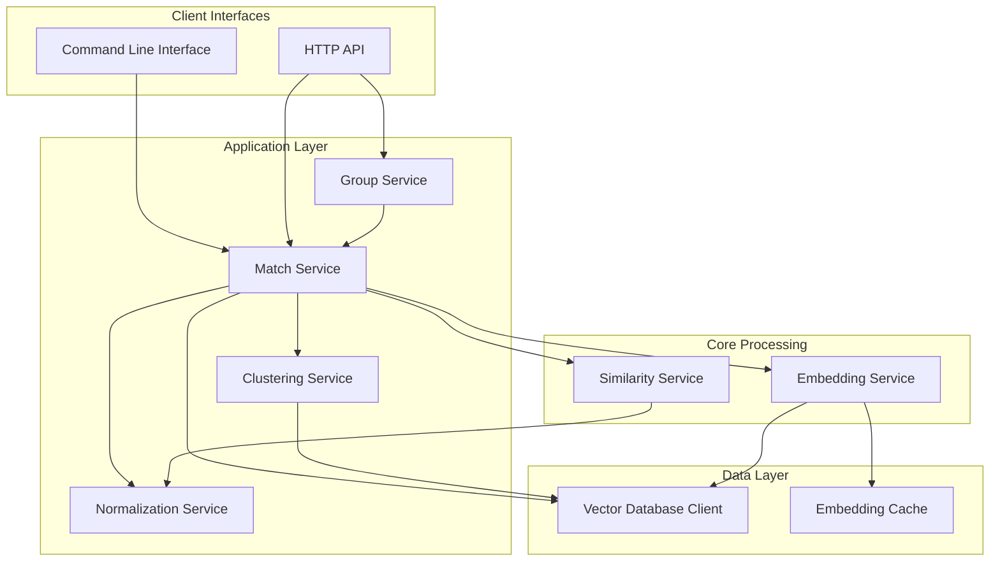

# Resolve

Resolve is a powerful entity matching system written in Go that provides high-precision entity resolution through semantic similarity and field-specific matching intelligence. It unifies fragmented records across data silos by identifying semantically similar entities even when data is messy, incomplete, or inconsistent.

## Features

- Semantic similarity using vector embeddings
- Field-specific similarity functions optimized for names, addresses, phones, emails, etc.
- Customizable attribute weighting and scoring
- Match groups with transitive closure support
- Multi-strategy blocking and clustering for performance
- Detailed match explanations and confidence scoring
- Configurable normalization pipeline
- Both CLI and API interfaces
- Production-ready performance for large datasets

## Architecture



Resolve follows a modular, layered architecture:

1. **Client Interfaces**
   - HTTP API for entity operations, matching, and grouping
   - CLI for batch processing and maintenance tasks

2. **Application Layer**
   - Match Service orchestrates the matching process
   - Group Service manages match groups and transitive closure
   - Normalization Service standardizes entity fields
   - Clustering Service partitions data for efficient retrieval

3. **Core Processing Layer**
   - Embedding Service generates vector representations
   - Similarity Service provides field-specific comparison functions

4. **Data Layer**
   - Vector Database Client for storage and search (Weaviate)
   - Embedding Cache for performance optimization

## Prerequisites

- Go 1.24+
- Weaviate instance (for vector database)
- Embedding service (for generating vector embeddings)

## Setup

### 1. Install Dependencies

```bash
go mod tidy
```

### 2. Configure Vector Database

Ensure you have a Weaviate instance running. You can use Docker to start one:

```bash
docker run -d --name weaviate-resolve \
  -p 8080:8080 \
  -e PERSISTENCE_DATA_PATH=/var/lib/weaviate \
  -e DEFAULT_VECTORIZER_MODULE=none \
  -e ENABLE_MODULES= \
  semitechnologies/weaviate:1.24.1
```

### 3. Set Up Embedding Service

Set up an embedding service that can generate vectors for your entity text.

### 4. Configure Resolve

Copy the sample configuration file and edit as needed:

```bash
cp config.yaml.sample config.yaml
```

Edit `config.yaml` to set up your Weaviate connection, API server settings, and embedding service configuration.

## Usage

### Command Line Interface

Resolve provides a CLI for batch operations and maintenance tasks:

```bash
# Ingest entities from a JSON file
resolve --ingest entities.json

# Match an entity from a JSON file
resolve --match-file query.json --threshold 0.8 --limit 5 --field-scores

# Match a string query
resolve --match "Acme Corporation" --threshold 0.7

# Recompute clusters for all entities
resolve --recompute-clusters

# Find a match group for an entity
resolve --group entity-123 --group-strategy transitive --group-hops 3
```

### API Server

Start the API server:

```bash
go run cmd/api/main.go --config config.yaml
```

### API Endpoints

#### Health Check

```bash
curl http://localhost:8080/health
```

#### Entity Operations

1. **Add an entity:**

```bash
curl -X POST http://localhost:8080/entities \
  -H "Content-Type: application/json" \
  -d '{
    "id": "entity-001",
    "fields": {
      "name": "Acme Corporation",
      "address": "123 Main St",
      "city": "New York",
      "state": "NY",
      "zip": "10001",
      "phone": "+1 555-123-4567",
      "email": "info@acme.com"
    },
    "metadata": {
      "source": "CRM",
      "type": "business"
    }
  }'
```

2. **Get an entity by ID:**

```bash
curl http://localhost:8080/entities/{id}
```

3. **Update an entity:**

```bash
curl -X PUT http://localhost:8080/entities/{id} \
  -H "Content-Type: application/json" \
  -d '{
    "fields": {
      "name": "Acme Corp Updated",
      "address": "456 New St"
    }
  }'
```

4. **Delete an entity:**

```bash
curl -X DELETE http://localhost:8080/entities/{id}
```

5. **Batch add entities:**

```bash
curl -X POST http://localhost:8080/entities/batch \
  -H "Content-Type: application/json" \
  -d '{
    "entities": [
      {
        "fields": {
          "name": "Entity 1",
          "address": "123 First St"
        }
      },
      {
        "fields": {
          "name": "Entity 2",
          "address": "456 Second St"
        }
      }
    ]
  }'
```

6. **Get entity count:**

```bash
curl http://localhost:8080/entities/count
```

#### Entity Matching

1. **Match an entity:**

```bash
curl -X POST http://localhost:8080/match \
  -H "Content-Type: application/json" \
  -d '{
    "entity": {
      "fields": {
        "name": "Acme Corp",
        "address": "123 Main St"
      }
    },
    "threshold": 0.7,
    "limit": 10,
    "include_field_scores": true,
    "use_clustering": true
  }'
```

2. **Match by text:**

```bash
curl -X POST http://localhost:8080/match/text \
  -H "Content-Type: application/json" \
  -d '{
    "text": "Acme Corporation in New York",
    "threshold": 0.7,
    "limit": 10,
    "include_field_scores": true
  }'
```

3. **Find match group:**

```bash
curl -X GET http://localhost:8080/match/group/{entity_id}?strategy=transitive&hops=2&threshold=0.8
```

4. **Recompute clusters:**

```bash
curl -X POST http://localhost:8080/clusters/recompute
```

## Field-Specific Similarity Functions

Resolve implements specialized similarity functions for different field types:

- **Name Comparison**: Uses specialized algorithms for business names and person names
- **Address Comparison**: Intelligent comparison accounting for abbreviations and formatting
- **Phone Comparison**: Digit-based comparison ignoring formatting differences
- **Email Comparison**: Domain-weighted matching with special handling for common patterns
- **Zip/Postal Code**: Prefix matching with graduated confidence
- **General Text**: Fallback to general-purpose string similarity algorithms

Each field is analyzed with the appropriate similarity function, providing more accurate field-level matching than generic string comparison.

## Match Groups & Transitive Closure

Resolve supports finding connected entities through both direct and transitive relationships:

### Direct Matching

Finds entities that directly match the query entity based on the similarity threshold.

### Transitive Matching

Uses graph traversal to find entities connected through intermediate matches. For example, if A matches B and B matches C, then A and C are transitively connected even if they don't directly match.

### Hybrid Matching

Combines direct and limited transitive matching for balanced results, using adjusted thresholds and hop limits.

Group retrieval options include:

- Strategy (direct, transitive, hybrid)
- Maximum hops for transitive matching
- Threshold overrides
- Maximum group size
- Field weights for scoring

## Clustering for Performance

Resolve implements a clustering system for efficient candidate retrieval, similar to blocking in traditional entity resolution systems:

### How Clustering Works

1. **Blocking key generation**: Extracts features from specified fields to create a composite blocking key
2. **Cluster ID assignment**: Assigns entities to clusters based on blocking keys
3. **Filtered matching**: First searches within the query entity's cluster
4. **Fallback mechanism**: Falls back to global search if needed

Configure clustering in the `config.yaml` file:

```yaml
clustering:
  enabled: true
  method: "canopy"
  fields:
    - "name"
    - "zip"
  similarity_threshold: 0.8
```

## Enhanced Match Results

Match results now include detailed field-level scoring:

```json
{
  "id": "entity-001",
  "score": 0.92,
  "fields": {
    "name": "Acme Corporation",
    "address": "123 Main St"
  },
  "matched_on": ["name", "address"],
  "explanation": "Matched with high confidence (0.92) on fields: name, address",
  "field_scores": {
    "name": {
      "score": 0.95,
      "query_value": "acme corp",
      "matched_value": "acme corporation",
      "similarity_function": "Name",
      "normalized": true
    },
    "address": {
      "score": 0.89,
      "query_value": "123 main street",
      "matched_value": "123 main st",
      "similarity_function": "Address",
      "normalized": true
    }
  },
  "metadata": {
    "source": "CRM",
    "created_at": 1649955600
  }
}
```

## Data Models

### EntityData

The model for representing entity information:

```json
{
  "id": "entity-001",
  "fields": {
    "name": "Acme Corporation",
    "address": "123 Main St",
    "city": "New York",
    "state": "NY",
    "zip": "10001",
    "phone": "+1 555-123-4567",
    "email": "info@acme.com"
  },
  "metadata": {
    "source": "CRM",
    "type": "business"
  }
}
```

### MatchResult

The model for entity matching results:

```json
{
  "id": "entity-001",
  "score": 0.92,
  "fields": {
    "name": "Acme Corporation",
    "address": "123 Main St"
  },
  "matched_on": ["name", "address"],
  "explanation": "Matched with high confidence (0.92) on fields: name, address",
  "field_scores": {
    "name": {
      "score": 0.95,
      "similarity_function": "Name"
    },
    "address": {
      "score": 0.89,
      "similarity_function": "Address"
    }
  },
  "metadata": {
    "source": "CRM",
    "created_at": 1649955600
  }
}
```

### MatchGroup

The model for entity match groups:

```json
{
  "group_id": "group-001",
  "size": 3,
  "average_score": 0.87,
  "primary_entity": "entity-001",
  "entities": [
    {
      "id": "entity-001",
      "score": 1.0,
      "fields": { ... }
    },
    {
      "id": "entity-002",
      "score": 0.92,
      "fields": { ... }
    },
    {
      "id": "entity-003",
      "score": 0.78,
      "fields": { ... }
    }
  ],
  "field_agreement": {
    "name": 0.95,
    "address": 0.82,
    "phone": 0.67
  }
}
```

## Configuration

Resolve can be configured through the `config.yaml` file. Key configuration options include:

### Server Configuration

```yaml
server:
  port: 8080

api:
  host: "0.0.0.0"
  port: 8080
  read_timeout_secs: 30
  write_timeout_secs: 30
  idle_timeout_secs: 60
```

### Vector Database Configuration

```yaml
weaviate:
  host: "localhost:8080"
  scheme: "http"
  api_key: ""
  class_name: "Entity"
```

### Embedding Service Configuration

```yaml
embedding:
  url: "http://localhost:8000"
  batch_size: 32
  timeout: 30
  cache_size: 1000
  model_name: "all-MiniLM-L6-v2"
  embedding_dim: 384
```

### Matching Configuration

```yaml
matching:
  similarity_threshold: 0.85
  default_limit: 10
  field_weights:
    name: 0.4
    address: 0.2
    city: 0.1
    state: 0.05
    zip: 0.05
    phone: 0.1
    email: 0.1
```

### Normalization Configuration

```yaml
normalization:
  enable_stopwords: true
  enable_stemming: true
  enable_lowercase: true
  name_options:
    remove_legal_suffixes: true
    normalize_initials: true
  address_options:
    standardize_abbreviations: true
    remove_apartment_numbers: true
  phone_options:
    e164_format: true
  email_options:
    lowercase_domain: true
```

### Clustering Configuration

```yaml
clustering:
  enabled: true
  method: "canopy"
  fields:
    - "name"
    - "zip"
  similarity_threshold: 0.8
```

## License

This project is licensed under the [MIT License](LICENSE).
